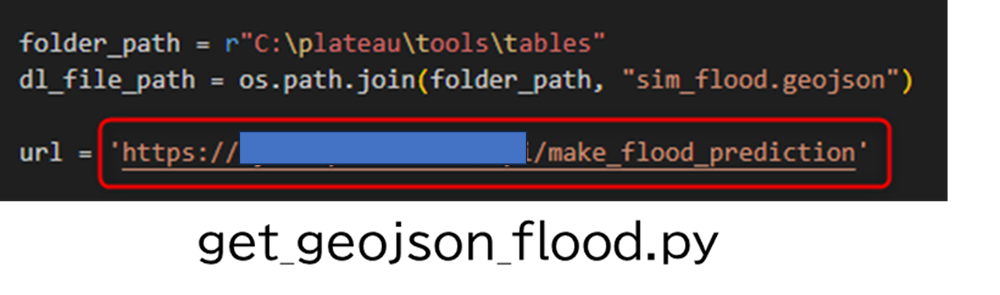
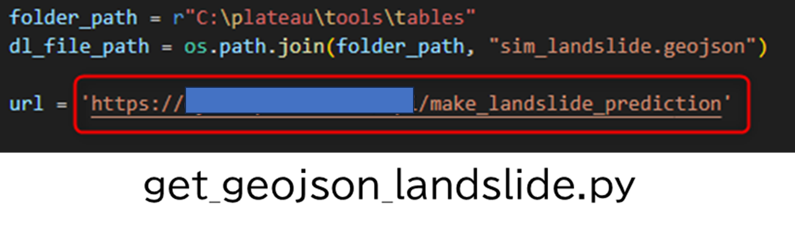

# 環境構築手順書

# 1. 環境構築手順書について

損害額シミュレータ（以下「本システム」という。）を利用するための環境構築手順について記載しています。本システムの構成や仕様の詳細については[技術検証レポート](https://XXXXX)も参考にしてください。

# 2. 動作環境

本システムの動作環境は以下のとおりです。

| 項目 | 最小動作環境 | 推奨動作環境 | 
| - | - | - | 
| OS | Microsoft Windows 10 又は 11 | 同左 | 
| CPU | 2コア、同時マルチスレッディング |  4コア（推奨）、10コア（最適） | 
| メモリ | 8GB以上 | 32GB（推奨）、64GB（最適） | 
| GPU | - | 4GB | 
| ディスプレイ解像度 | 1024×768以上 |  1080p以上  | 
| ストレージ | 32GB以上の空き容量 |  32 GB 以上の空き容量 （ソリッドステートドライブ (SSD） 上） | 
| ソフトウェア | ArcGIS Pro 3.1（Basic以上のライセンス） | 同左 | 
| ソフトウェアオプション | - | ArcGIS 3D Analyst※ | 

※ArcGIS 3D Analystとは、ArcGIS Proのエクステンション（有料のツールオプション）のことです。
3D都市モデルをファイルジオデータベース（FGDB）形式に変換する場合に必要となります。一部の市においては、FGDB形式でデータが配布されているので、それを利用する場合は本オプションは不要となります。

# 3. ArcGISのインストール手順

- [My Esri](https://www.esri.com/ja-jp/my-esri-login)からArcGIS Pro(バージョン 3.1）をダウンロードし、インストールを行います。
※ArcGIS Proをダウンロードするには有料ライセンスが必要なため、ESRIジャパン（株）からライセンスを購入ください。

- 続いて、[My Esri](https://www.esri.com/ja-jp/my-esri-login)から「ArcGIS Coordinate Systems Data」をダウンロードし、インストールを行います。インストール手順に不明点があれば[こちら](https://pro.arcgis.com/ja/pro-app/latest/help/mapping/properties/arcgis-coordinate-systems-data.htm)も参照してください。

# 4. 本システムのダウンロード

ソースファイルをダウンロードし、適切なフォルダに配置するだけでプログラムが実行可能です。
ソースファイルは[こちら](https://github.com/Project-PLATEAU/Disaster-damage-simulator/tree/main/src)からダウンロード可能です。

GitHubからダウンロードしたフォルダを「Cドライブ直下」の「C:\plateau」となるように配置ください。
Cドライブ以外のドライブに配置してもプログラムは動きませんので、ご注意ください。
配置後のフォルダ構成は以下のようになります。

# 5. APIの作成
続いて浸水APIや土砂APIを利用する場合はAPIの作成が必要となります。
APIのIF仕様書は5-1と5-2を参照してください。
接続するAPI（URL）が明確になったら、以下のファイルの接続先URLを変更してください。
- フォルダパス 
    C:\plateau\tools\python
- 対象ファイル 
    浸水シミュレーションAPI：get_geojson_flood.py 
    土砂シミュレーションAPI：get_geojson_landslide.py
- 方法 
    対象ファイル内の変数[url] に設定しているURLを、自身が作成したURLに変更

## 5-1. インターフェース仕様書
APIを利用するにはインターフェース仕様書に従って、APIの作成が必要となります。
参考資料の「浸水APIのインターフェース仕様書」や「土砂APIのインターフェース仕様書」をご覧ください。