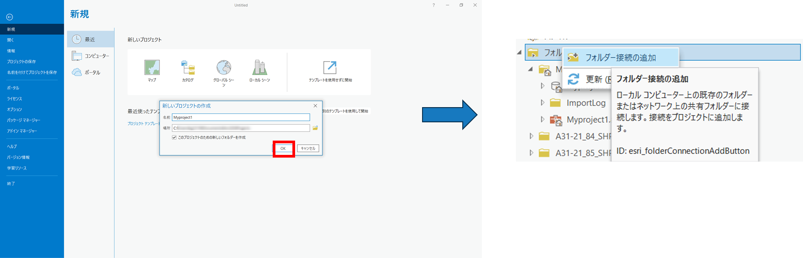
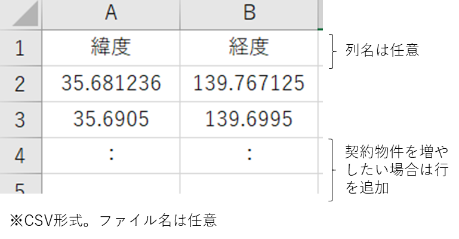

# データの準備

# 1. データ準備マニュアルについて

損害額シミュレータ（以下「本システム」という。）を動かすために事前準備すべきデータとその準備手順を記載しています。

# 2. データ準備手順

本システムで必要となるデータの準備は以下の手順で行います。

## 2-1. 3D都市モデルの変換
CityGML形式の3D都市モデルをファイルジオデータベース形式（FGDB形式）に変換するための手順です。サンプルデータとして静岡県牧之原市のデータ※1が格納されています。

- [3D都市モデル「CityGML(v2)」](https://www.geospatial.jp/ckan/dataset/plateau)をダウンロードください。v1では動きませんのでご注意ください。

- CityGML形式からFGDB形式への変換はESRI社が公開している「[3D-CityModel-ConversionTools-for-ArcGIS-v2](https://github.com/EsriJapan/3D-CityModel-ConversionTools-for-ArcGIS-v2)」の手順に沿って変換してください。ただし、この変換を行うにはArcGIS Proのエクステンション（有料オプション）である「ArcGIS 3D Analyst」が必要となりますのでご注意してください。

## 2-2. 洪水浸水想定区域データの変換
シェープ形式の「国土数値情報 洪水浸水想定区域データ（第3.0版）」をFGDB形式に変換するための手順です。サンプルデータとして静岡県の「計画規模と想定最大規模」※2が格納されています。

- シェープ形式の[洪水浸水想定区域データ](https://nlftp.mlit.go.jp/ksj/gml/datalist/KsjTmplt-A31-v3_0.html)をダウンロードしてください。

- ArcGIS Proを起動し、プロジェクトファイルを作成します。（プロジェクトファイル名に指定はありません。手順書上は「Myproject1」としています。）

- カタログウィンドウ上で「フォルダー接続の追加」を行い、先ほどダウンロードしたシェープファイルをプロジェクトファイルに接続します。 

- 変換する計画規模のデータをマップにドラッグ&ドロップをして追加し、確認します。

- [解析]タブ→[ツール]→[ジオプロセシング]ウィンドウのツールの検索窓に「マージ（Merge)」と入力 → [マージ(Merge)]と入力という手順により、「マージ（Marge）」ツールを起動します。

- ①入力データセットを指定し、②出力データセットで「C:\plateau\data\hazard_data\洪水浸水想定区域.gdb」に 「計画規模」の名称で設定し、③[フィールドマップ]の「A31_102」の[プロパティ]で[エイリアス]を「河川名」と設定し、実行をクリックします。エイリアス一覧は[サイト](https://nlftp.mlit.go.jp/ksj/gml/datalist/KsjTmplt-A31-v3_0.html)をご覧ください。

- FGDB形式に変換されたことが確認できます。 

- 変換する想定最大規模のデータをマップにドラッグ&ドロップをして追加し、確認します。

- [解析]タブ→[ツール]→[ジオプロセシング]ウィンドウのツールの検索窓に「マージ（Merge）」と入力という手順により、[マージ（Merge）] ツールを起動します。

- ジオプロセシングツールである「マージ（Merge）」ツールを使用し、①入力データセットを指定し、②出力データセットで「C:\plateau\data\hazard_data\洪水浸水想定区域.gdb」に「想定最大規模」の名称で設定し、③[フィールドマップ]の「A31_202」の[プロパティ]で[エイリアス]を「河川名」と設定し、実行をクリックします。エイリアス一覧は[サイト](https://nlftp.mlit.go.jp/ksj/gml/datalist/KsjTmplt-A31-v3_0.html)をご覧ください。

- FGDB形式に変換されたことが確認できます。 

## 2-3. 契約フラグを立てるためのデータ準備
契約フラグを立てるためには、契約物件一覧の「緯度経度」を記載したCSVデータをFGDB形式に変換します。

- 契約フラグを立てたい物件の「緯度経度」が書かれたCSVファイルを準備してください。1行目はタイトル行のため、データは記載しないようご注意ください。タイトル名は任意です。以下のようなサンプルCSVを作成してください。契約フラグを立てたい建物の分だけ緯度経度の行を増やしてください。ファイル名は任意です。 

 
- ArcGIS Pro を起動します。

- [解析]タブ→[ツール]→[ジオプロセシング]ウィンドウの検索窓に「xy」と入力→[XYテーブル→ポイント]ツールをクリックという手順を踏んだ上で、更に以下の設定を行い、[実行]をクリックします。入力テーブルには上記で作成したCSVファイルを指定してください。 

## 2-4. 設定ファイルの更新
「C:\plateau\tools\tables」に以下の3つのファイルがあります。ダミーの値が設定されているので、適切に修正ください。いずれも「用途×構造種別」ごとに値を設定する必要があります。用途と構造種別の番号は、[製品仕様書](https://www.mlit.go.jp/plateau/file/libraries/doc/plateau_doc_0001_ver03.pdf)をご確認ください。 
用途：製品仕様書のP118の"Building_usage.xml"を参照してください。 
構造種別：製品仕様書のP133の"BuildingDetailAttribute_buildingStructureType.xml "を参照してください。 

- 評価額_建物単価.csv：1平米あたりの単価[円]を記載します。
- 浸水損傷率_建物.csv：浸水深あたりの損害率を記載します。
- 土砂損傷率_建物.csv：堆積深あたりの損害率を記載します。 

評価額のCSVイメージ 

損傷率のCSVイメージ 

## 3. 出典
※1 「3D都市モデルのサンプルデータ」を掲載しております。
- 出典：[国土交通省ホームページ](https://www.geospatial.jp/ckan/dataset/plateau)
- [「3D都市モデル」（国土交通省）](https://www.geospatial.jp/ckan/dataset/plateau)を加工して作成

※2 「浸水想定区域のサンプルデータ」も掲載しております。
- 出典：[国土交通省国土数値情報ダウンロードサイト](https://nlftp.mlit.go.jp/ksj/gml/datalist/KsjTmplt-A31-v3_0.html)
- [「国土数値情報（洪水浸水想定区域データ）」（国土交通省）](https://nlftp.mlit.go.jp/ksj/gml/datalist/KsjTmplt-A31-v3_0.html)を加工して作成

