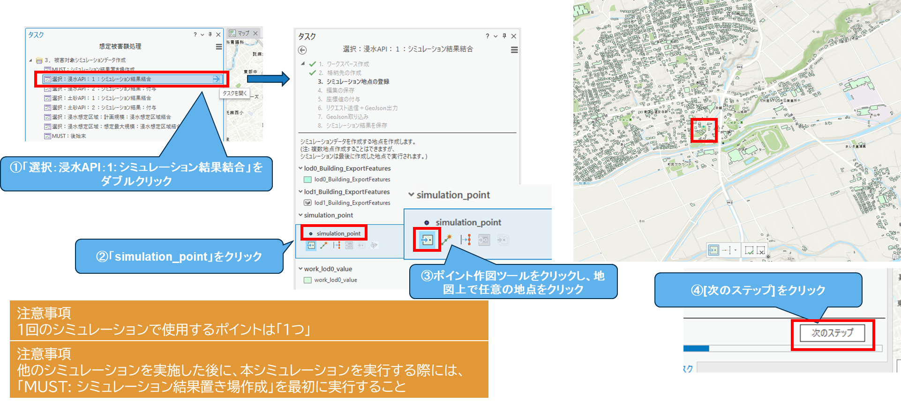
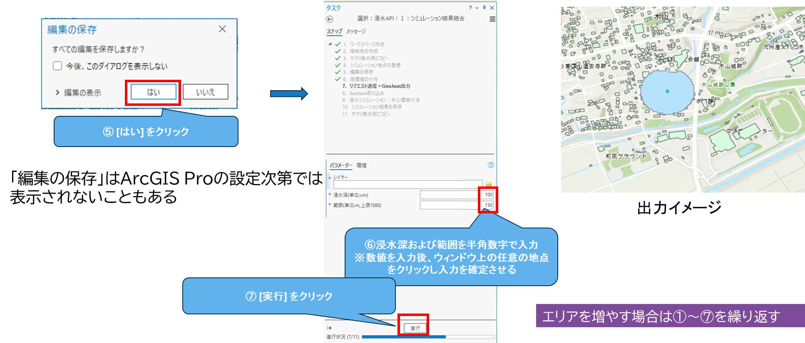
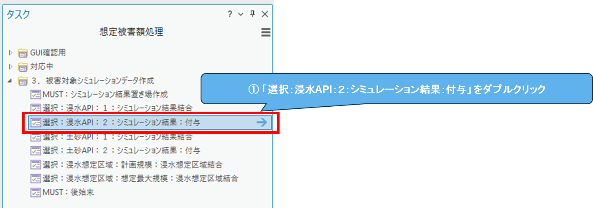
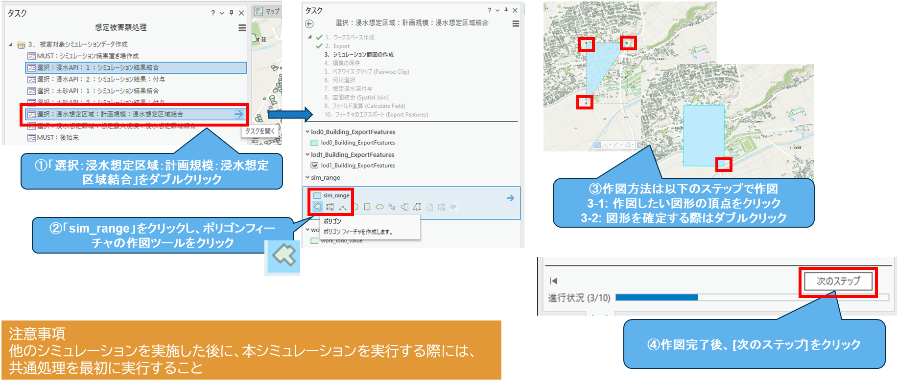
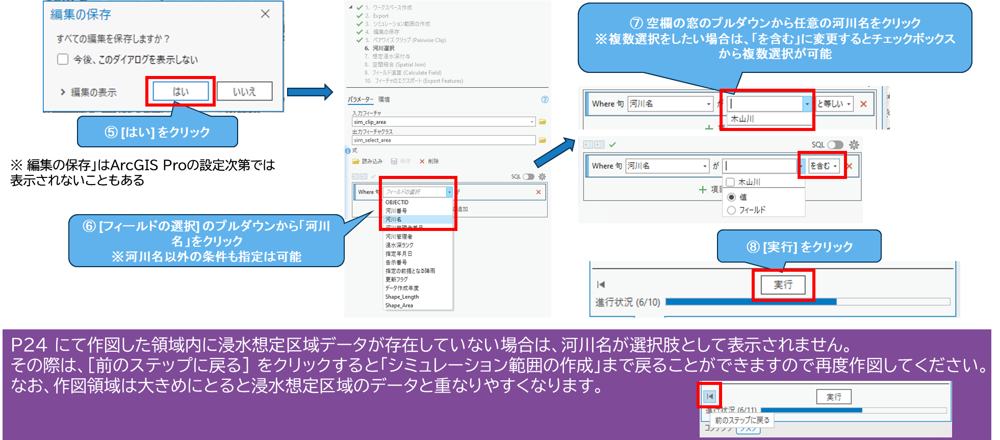
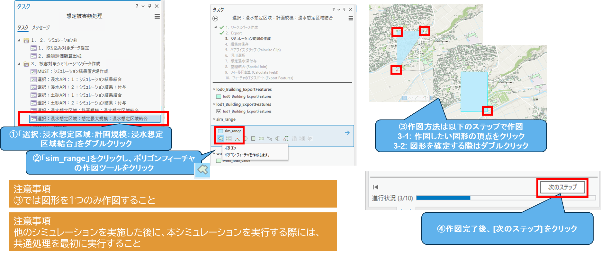

# 操作マニュアル

# 1. 本書について

本書では、損害額シミュレータ（以下「本システム」という。）の操作手順について記載しています。

# 2. 使い方

## 2-1. 本システムの起動
- 「plateau_hazard_simulation.aprx」をダブルクリックし、ArcGIS Pro を起動ください。※起動時に認証が求められた場合は、アカウントをお持ちと思いますので、そのID/PWでサインインください。
  

- タスクウィンドウを表示させます。
  

## 2-2. 「1.2. シミュレーション前」の実行

- シミュレーションを行いたい3D都市モデル（FGDB形式）を指定し、読み込みます。
  

- 読み込んだ3D都市モデル（FGDB形式）に対して評価額を算出します。
  

## 2-3. 「3. 被害対象シミュレーションデータ作成」の実行

### 2-3-1. 事前処理
- 被害シミュレーションデータの事前処理を行います。
  

### 2-3-2. 浸水APIの場合
- 緯度・経度・浸水深などを指定してシミュレーションを行う場合にこの操作を行います。複数の地点の浸水深を指定したい場合は、この処理を繰り返してください。
  
  

- 指定終わりましたら、シミュレーション結果と建物情報を結合します。この作業が終わりましたら[2-3-6. 事後処理]の手順を実行ください。
  

### 2-3-3. 土砂APIの場合
- 緯度・経度・堆積深などを指定してシミュレーションを行う場合にこの操作を行います。複数の地点の堆積深を指定したい場合は、この処理を繰り返してください。
  
  

- 指定終わりましたら、シミュレーション結果と建物情報を結合します。この作業が終わりましたら[2-3-6. 事後処理]の手順を実行ください。
  

### 2-3-4. 浸水想定区域：計画規模の場合
- 計画規模の浸水想定区域から浸水エリアを指定します。この作業が終わりましたら[2-3-6. 事後処理]の手順を実行ください。
  
  

### 2-3-5. 浸水想定区域：想定最大規模の場合
- 想定最大規模の浸水想定区域から浸水エリアを指定します。この作業が終わりましたら[2-3-6. 事後処理]の手順を実行ください。
  
  

### 2-3-6. 事後処理
- 被害シミュレーションデータの共通的な事後処理を行います。
  

## 2-4. 「4. シミュレーション後操作」の実行

- 損傷率と損害額を算出します。
  

- 建物情報に契約情報と建物不動産IDを紐づけます。
  

- ポップアップなどで使用する論理名(エイリアス)を設定します。
  

## 2-5. シミュレーション結果を確認する
これで全ての処理が終わりました。建物1つ1つをクリックすると、詳細な情報を確認できます。

