# 土砂API 操作マニュアル

# 1. 土砂APIとは
「土砂API」を利用して土砂災害シミュレーションを行います。本ページでは「土砂API」の使い方を説明しています。

# 2. 使い方

## 2-1. 起動
- 「plateau_hazard_simulation.aprx」をダブルクリックし、ArcGIS Pro を起動ください。※起動時に認証が求められた場合は、お持ちのアカウントのID/PWでサインインください。
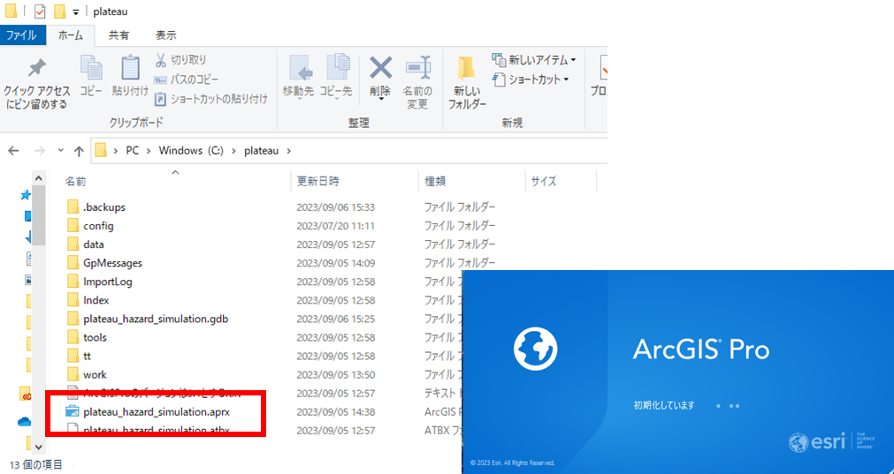  

- タスクウィンドウを表示させます。
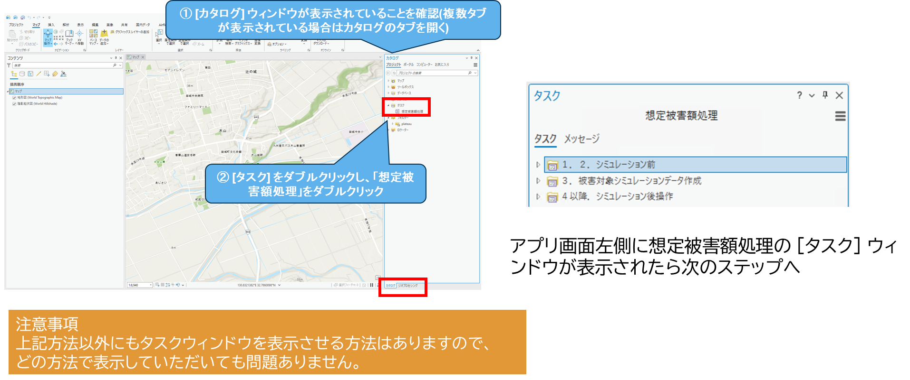  

## 2-2. 「1.2. シミュレーション前」の実行

- シミュレーションを行いたい3D都市モデル（FGDB形式）を指定し、読み込みます。
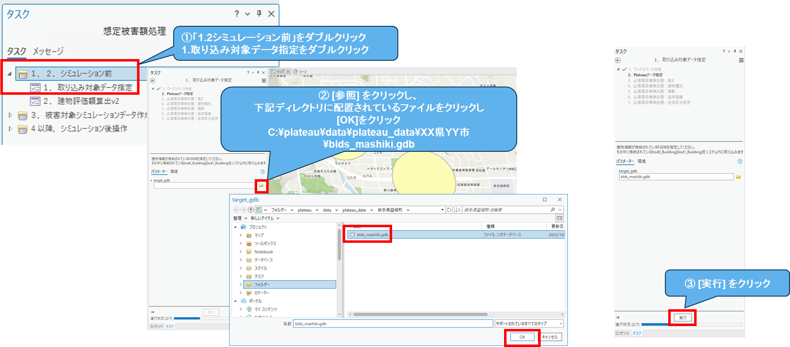  

- 読み込んだ3D都市モデル（FGDB形式）に対して評価額を算出します。
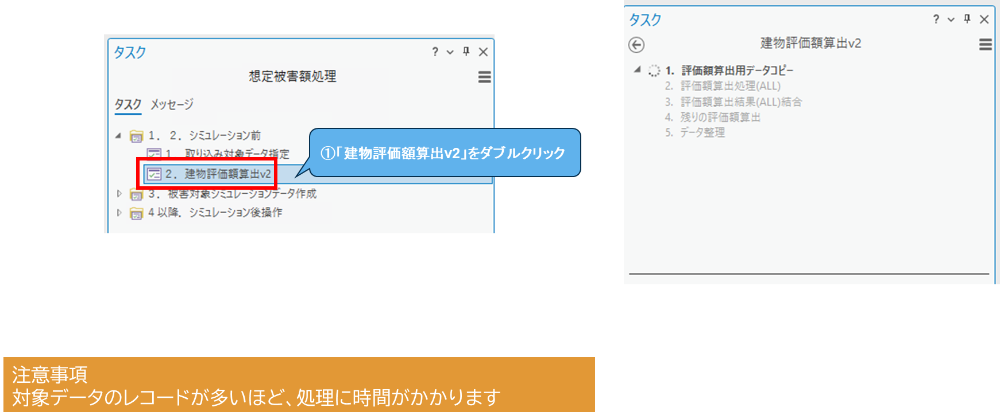  

## 2-3. 「3. 被害対象シミュレーションデータ作成」の実行

- 被害シミュレーションデータの事前処理を行います。
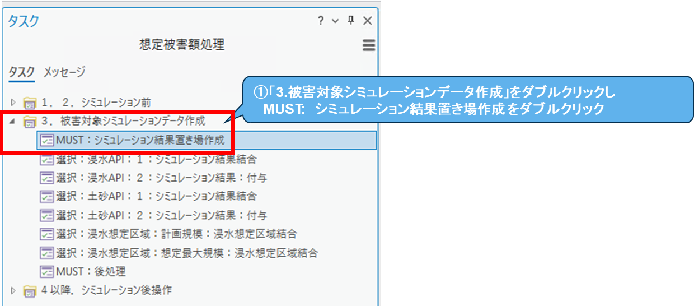  

- 土砂APIを利用してシミュレーションを行います。複数の地点の堆積深を指定したい場合は、この処理を繰り返してください。
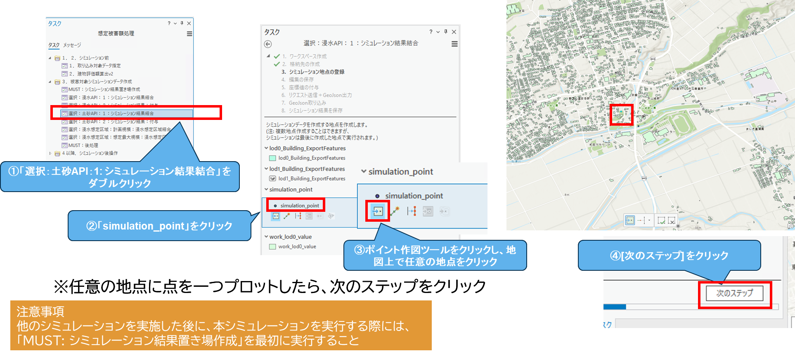  
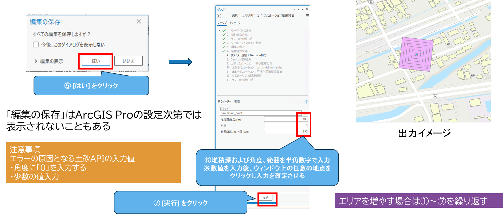  

- 指定後、シミュレーション結果と建物情報を結合します。
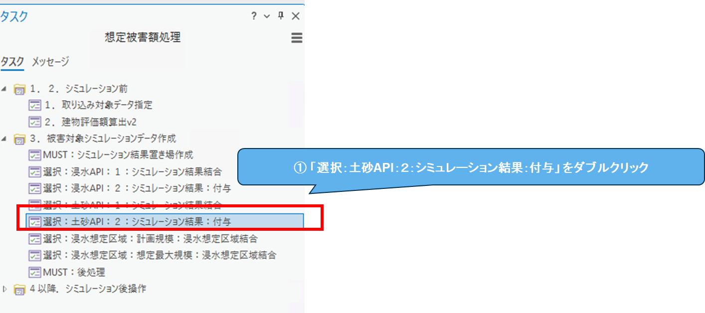  

- 被害シミュレーションデータの事後処理を行います。
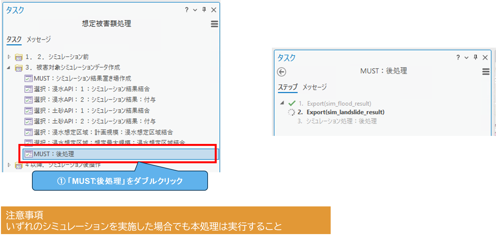  

## 2-4. 「4. シミュレーション後操作」の実行

- 損傷率と損害額を算出します。
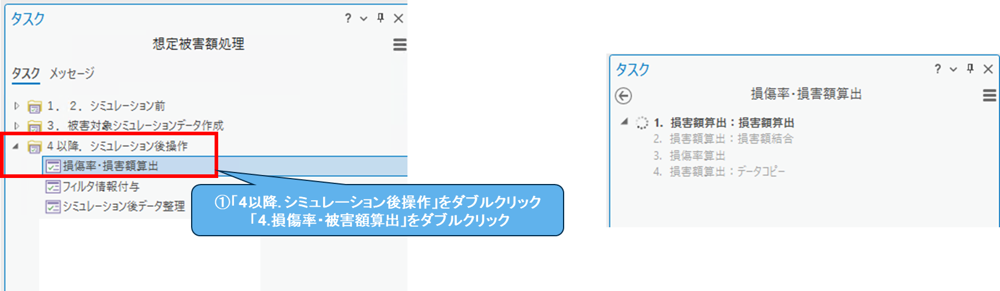  

- 建物情報に契約情報と建物不動産IDをひも付けます。
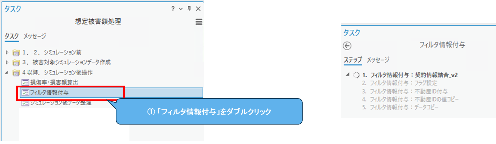  

- ポップアップなどで使用する論理名（エイリアス）を設定します。
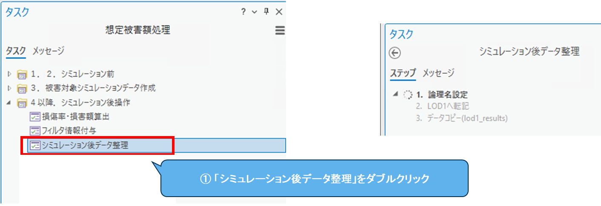  

## 2-5. シミュレーション結果を確認する
2-4.までで全ての処理が完了しました。個々の建物をクリックすると、結果の詳細を確認できます。
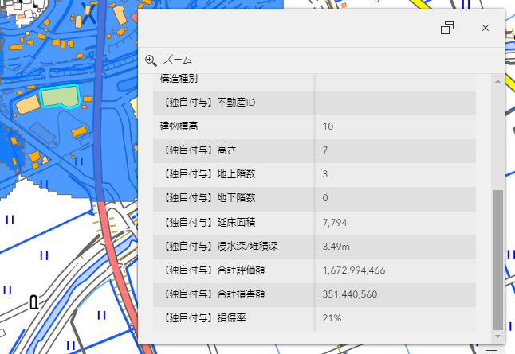  

