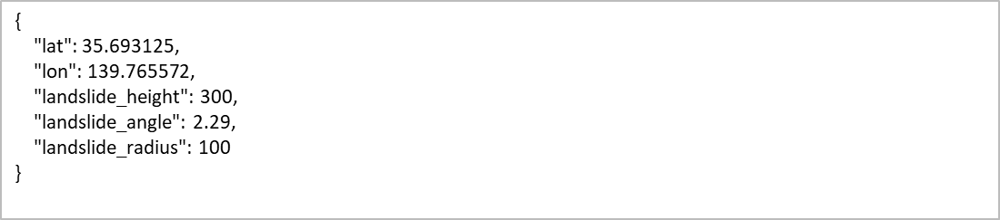
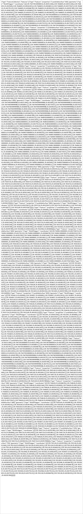

# 土砂APIのインターフェース仕様

利用者自らが土砂APIを準備する必要があり、そのためのインターフェース仕様を記載しています。これに沿ったAPIを作成すれば、土砂API（土砂API 操作マニュアル参照）の利用が可能となります。

### リクエスト
- 概要：土砂エリア生成リクエスト
- アクセスURL：https://[サーバごとに設定]/make_landslide_prediction
- メソッド：POST
- 形式：Json
- 文字コード：UTF-8
- 引数

| No. | 変数             | 出現条件 | 出現回数 | 必須  | 値（型） | 例         | 内容         | 備考                                      |
|-----|------------------|----------|----------|-------|----------|------------|--------------|-------------------------------------------|
| 1   | lat              | 　       | 1        | ○    | 実数     | 35.693125  | 中心緯度     | 　                                        |
| 2   | lon              | 　       | 1        | ○    | 実数     | 139.765572 | 中心軽度     | 　                                        |
| 3   | landslide_height | 　       | 1        | ○    | 整数     | 300        | 堆積高さ(cm) | 堆積物の地表面からの高さ（cm）            |
| 4   | landslide_angle  | 　       | 1        | ○    | 実数     | 2.29       | 堆積角度(°)  | 堆積物と地表が交わる接点角度（°）         |
| 5   | landslide_radius | 　       | 1        | ○    | 整数     | 100        | 計算範囲(m)  | 計算を実施する半径（m）　※～600ｍまで対応 |

Json形式による土砂エリア生成リクエストの例

### レスポンス
- 概要：土砂エリア生成レスポンス
- 形式：GeoJson
- レスポンス

| No. | 変数                                | 出現条件 | 出現回数 | 値（型） | 例  | 内容             | 備考   |
|-----|-------------------------------------|----------|----------|----------|-----|------------------|--------|
| 1   | Feature/properties/LandslideSurface | 　       | *        | 実数     | 560 | 堆積面高さ（cm） | TP標高 |

GeoJson形式による土砂エリア生成レスポンスのGeoJson例

### レスポンスコード
- 概要：レポート作成レスポンスコード一覧（基本ベースはHTTPステータスコード準拠、特記部分のみ記載）
- 形式：Json

| No. | レスポンスコード           | 要因                                                                                                                                              |
|-----|----------------------------|---------------------------------------------------------------------------------------------------------------------------------------------------|
| 1   | 201 Created                | リクエストが受理され、GeoJsonが作られた場合                                                                                                       |
| 2   | 204 No Content             | リクエストは受理されたが、GeoJsonが生成されない場合      ・対象エリア範囲外（DEMデータ整備範囲外）      ・入力された浸水高で浸水が広がらない など |
| 3   | 400 Bad Request            | リクエストで受理できない場合      ・指定された計算範囲(m)が範囲外 など                                                                            |
| 4   | 403 Forbidden              | 認証しているIPアドレス以外からリクエストを受信した場合                                                                                            |
| 5   | 405 Method Not   Allowed   | リクエスト受信がPOSTではない場合                                                                                                                  |
| 6   | 422 Unprocessable   Entity | リクエスト受信したJSON形式のフォーマット異常の場合                                                                                                |
| 7   | 500 Internal Server Error  | リクエストは受理したが、GeoJsonの生成時にエラーが発生した場合                                                                                     |

